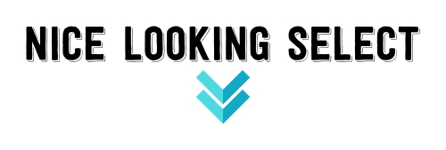
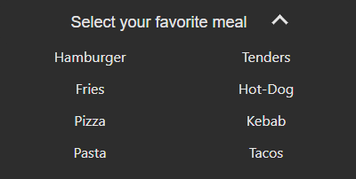
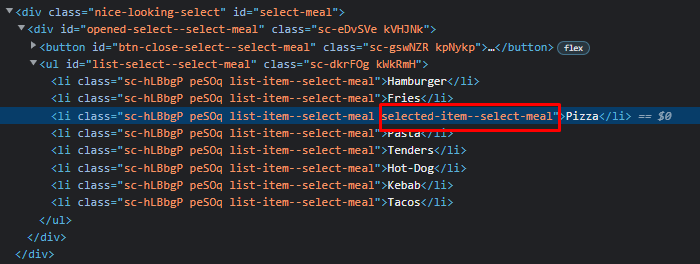

# Nice Looking Select - Sébastien D



## 📖 Description
Generate nice drop-down lists (&lt;select&gt;).


## 👀 Preview




## 📜Installation
```cmd
npm i react-nice-looking-select
```


## ⚙️ Use
1. Import the plugin in your project like this : 
```javascript
import NiceLookingSelect from "react-nice-looking-select";
```

2. Set your options :
```javascript
const options = [
    "Hamburger",
    "Fries",
    "Pizza",
    "Pasta",
    "Tenders",
    "Hot-Dog",
    "Kebab",
    "Tacos"
]
```

3. In the return : 
```javascript
<NiceLookingSelect options={options} parameter={parameter} />
```

4. Retrieve the selected value :
You need to retrieve the element containing the class "selected-item--YOUR_ID_SELECT".

As on the picture below :



## 🎨 Personalize
1. Put this into your file :
```javascript
const parameter = {
    "backgroundColor": "#2D2D2D",
    "borderRadius": "10px",
    "centerOptions": true,
    "centerTitle": true,
    "chevronsColor": "#E5E5E5",
    "columnsNumber": 2,
    "fontColor": "#E5E5E5",
    "hoverColor": "#4ED8E0",
    "id": "select-meal",
    "showChevrons": true,
    "title": "Select your favorite meal"
}
```

	
## 📝 License
MIT © [sebastien-d-me](https://github.com/sebastien-d-me)